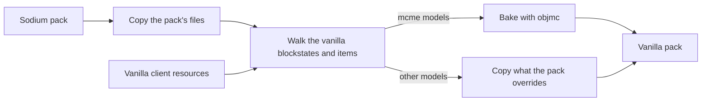

# ResourcePackScripts

Tools for the MCME (Minecraft Middle-earth) resource packs. The main one, **generateVanilla**, turns the **Sodium variant** of a pack into its **vanilla variant**.

The Sodium variant's 3D models are `.obj` files, which only render with the Special Model Loader client mod. generateVanilla bakes each of those models with [objmc](https://github.com/Godlander/objmc) into an ordinary block model plus a texture that carries the geometry. Core shaders in the pack then draw the real shape, so players see the same models without any mods.

- [User manual](#user-manual): generate the vanilla variant of a pack
- [Developer manual](#developer-manual): work on the code
- [Other scripts](#other-scripts): small standalone helpers

**How a pack gets from its repository to the players** is in the **[documentation](docs/README.md)**: setting up a pack repository, the release pipeline on the server, the conversion in detail, and troubleshooting.

## How it works



1. **Copy the pack's own files.** These are `pack.mcmeta`, where "Sodium" in the description becomes "Vanilla", plus `pack.png`, `license.txt`, `README.md` and the `assets` folder. A few folders under `assets` are skipped because step 2 rebuilds them. The pack's `vanilla` folder goes on top, apart from the folders that are rebuilt, then the `1_*` version overlays.
2. **Walk every blockstate and item definition the vanilla client has.** For each one it takes the pack's version if there is one, and handles every model it names:
   - An `mcme:` model is baked by objmc. The entry is then pointed at the baked model.
   - Any other model has its parent chain followed. Every model and texture along the way that the pack overrides is copied.
3. **Write out** the blockstates and item definitions that came from the pack.

## User manual

### What you need

- **Python 3.10 or newer**, with the dependencies installed: `pip install -r requirements.txt`. That gives you PyYAML and Pillow. pytest is only needed for the tests.
- **The Sodium pack**, for example a checkout of [RP-Human](https://github.com/MCME/RP-Human) `master`.
- **The vanilla resources** of the Minecraft version the pack targets. Unzip the client jar, `.minecraft/versions/<version>/<version>.jar`, and use the folder that contains `assets/`. The tool reads `assets/minecraft/blockstates`, `items` and `models` from it. Only blocks and items in that version's list are converted. The release server uses 1.21.4's, so use those to see what a release will contain.

### Generate the vanilla pack

```bash
python generateVanilla/generateVanilla.py <sodium pack> <output folder> <vanilla resources> --objmc generateVanilla/objmc.py
```

For example, with RP-Human cloned into this folder (`RP-Human/` is ignored by git here) and the vanilla resources unzipped beside it:

```bash
python generateVanilla/generateVanilla.py RP-Human ../RP-Human-vanilla ../minecraft-26.2 --objmc generateVanilla/objmc.py
```

- **Always pass `--objmc`.** Without it the tool looks for `objmc.py` in the folder you run it from.
- **Use a new, empty output folder for every run.** The tool adds to an existing folder but never deletes from it, so files removed from the pack would stay behind.
- It writes a `debug.log` into the folder you run it from.

| Option | What it does |
|---|---|
| `--objmc PATH` | The objmc script to bake models with. Default: `objmc.py` in the current folder. |
| `--limit N` | Keep only the first N models of each blockstate variant's model list, and of each multipart `apply` list. That gives a smaller pack, faster. The Lite variant uses `--limit 2`. |
| `--compress` | Write the generated JSON without indentation. |
| `--debug` | Print each step as it happens. The same lines go to `debug.log`. |
| `--noblocks` | Skip the blockstates. |
| `--noitems` | Skip the item definitions. |

### What the pack contains

```text
<pack>/
├── pack.mcmeta                    copied; "Sodium" in the description becomes "Vanilla"
├── pack.png, license.txt, README.md
├── assets/                        copied, except the folders rebuilt below
│   ├── mcme/models/…/<name>.json     Sodium model, in Special Model Loader's format
│   ├── mcme/models/…/<name>.obj      its geometry
│   ├── mcme/models/…/<name>.mtl      names its texture, e.g. "map_Kd mcme:block/pine_leaves"
│   ├── mcme/models/…/<name>.objmeta  optional conversion settings, see below
│   └── mcme/textures/…               the textures the .mtl files name
├── vanilla/                       optional: files only the vanilla variant gets
│   ├── assets/…                      copied on top of the pack's assets, except the rebuilt folders
│   └── 1_*/                          version overlays
└── 1_*/                           version overlays ("overlays" in pack.mcmeta), copied as they are
```

- **The Sodium model JSON** names its `.obj` in `model`, for example `"model": "mcme:models/block/leaves_parent.obj"`. It reads the `.mtl` with its own name, or the one named in `mtl_override`.
- **The objmc core shaders are not generated.** The baked models only render with objmc's shaders in the vanilla pack. RP-Human keeps them in `vanilla/assets/minecraft/shaders/`. They must match the objmc in this repository: when objmc changes, as with the mipmapping and cutout changes of 1 October 2026, every pack needs the matching shaders (RP-Human from commit `621c00c3d`).
- **Some folders are rebuilt instead of copied:** every namespace's `blockstates`, `items`, `models`, `textures/block` and `textures/item`. Only what the blockstates and items actually use ends up in the output.
  - `assets/mcme/sml_load_scopes` is left out too, because only Special Model Loader reads it.
  - `modelengine`'s models and items are copied as they are.

### Conversion settings (`.objmeta`)

A `.objmeta` is a YAML file next to the model JSON, with the same name. Every key is optional:

| Key | Default | Effect |
|---|---|---|
| `texture` | the `.mtl`'s `map_Kd` | Texture to bake from: `mcme:block/x`, or `minecraft:block/x` for one in the pack's own `assets/minecraft/textures/` |
| `output_texture` | the model's path | Name of the baked texture, under `assets/mcme/textures/` |
| `offset` | `-0.5 0.0 -0.5` | Moves the model before baking (x y z) |
| `options` | none | `noshadow` turns off face shading. `flipuv` is for a texture that comes out upside down. |
| `visibility` | `7` | objmc's visibility bits: 4 world, 2 hand, 1 GUI |
| `omnidirectional_parent` | `false` | The model looks the same from every side, so all its rotations share one parent |

The `parent` key is no longer read. Since the parent rework (#4), shared parents come from `.obj` names instead; see below.

### How models are converted

- **`mcme:` models:** every blockstate or item entry that names an `mcme:` model is baked by objmc. The result is `assets/mcme/models/<model>.json` plus a texture under `assets/mcme/textures/`.
- **Rotations:** an entry's `x`, `y` or `z` rotation is baked into the model. The tool rotates the `.obj` before objmc sees it, and the files get a suffix such as `<model>_y_90`. Only one axis can be baked, so if an entry has several, the first of `x`, `y` and `z` is used and the rest are dropped with a warning.
- **Shared parents:** an `.obj` named `parent` or `…_parent`, optionally numbered, is shared. For example `leaves_parent.obj` or `parent_2.obj`. Sharing happens when two models read the same one, at the same y-rotation, and bake to textures of the same size. Their geometry is then stored once, in a model named after the `.obj`, such as `leaves_parent.json`. **Give every texture used with one parent `.obj` the same size**: a mismatch can corrupt other models' geometry (see [Shared parents](docs/conversion.md#shared-parents)).
- **Other models** (`minecraft:` and other namespaces): the tool follows the model's parent chain and copies every model and texture along it that the pack overrides. Models the pack doesn't override are left to the client's own copy.
- **Animated textures:** a texture with an `animation` `.png.mcmeta` gets one copy of the bake per frame, stacked, so the model stays animated. See [Animated textures](docs/conversion.md#animated-textures).
- **Where blockstates and item definitions come from:** the pack's `vanilla` folder first, then the pack, then the vanilla resources. The ones that came from the pack are written to the output.

### Warnings

A problem with one model normally doesn't stop the run. The tool prints a `WARNING` line, skips that model or file, and carries on, so read the warnings after every run. A few input errors, such as invalid JSON, do stop it (see [What stops a run](docs/conversion.md#what-stops-a-run-and-what-doesnt)). The most common warnings:

| Warning | Meaning |
|---|---|
| `Missing model file: …` | A model is named that neither the pack nor vanilla has. |
| `Expected model file not found: …` | An `mcme:` model has no model JSON. |
| `Multiple rotations for …` | Only the first rotation axis was baked. |
| `… shares parent group … but its baked texture is …` | Same parent `.obj` but a different texture size. Fix it: it can corrupt other models. |
| `… leads outside the pack - skipping …` | A path or symlink in the pack points outside it. Fix the pack. |
| `Rotation … is not a number` | The entry's rotation isn't a number, so the model is skipped. |
| `Missing assets folder` / `Missing vanilla overrides folder` | The pack has no such folder. The rest is still generated. |
| `Unrecognised texture value for …` | A model's `textures` entry has a form the tool doesn't know. |

objmc's own errors, such as a model too big to encode, appear after `Error running process script` together with objmc's output. That model is skipped.

A model JSON without a `model` key, or a missing `.obj`, is skipped **without any message**. The full list of messages, with what to do about each, is in [Troubleshooting](docs/troubleshooting.md#generator-warnings).

### Running it safely

Many people can push to the resource pack repos, so treat a pack as input you don't fully trust:

- The tool already skips paths and symlinks that lead outside the pack. Even so, run it as a user that can only write its own work folder.
- Clone the pack with `git -c core.symlinks=false clone …`, so symlinks in it arrive as plain files.
- Use a fresh output folder, and review the result before publishing it.

## Other scripts

Standalone helpers. generateVanilla doesn't use them.

| Script | What it does |
|---|---|
| `generateVanilla/rotate_obj.py <file.obj> <axis> <angle>` | Rotates an `.obj` **in place** by 90, 180 or 270 degrees around `x`, `y` or `z`. |
| `finder.py <model>` | Reports which blockstates and parent models use the block model `<model>` (name without `block/`). Read-only. |
| `sorter.py` | **Moves** every block model and texture that no blockstate uses into `unlinked_models/` and `unlinked_textures/`, without asking. Run it on a copy. |

`finder.py` and `sorter.py` don't read a pack. They run in a folder laid out as `blockstates/`, `vanilla_blockstates/`, `models/block/`, `vanilla_models/block/` and `textures/block/`.

## Developer manual

### Setup

```bash
python -m venv .venv
source .venv/bin/activate        # Windows: .venv\Scripts\activate
pip install -r requirements.txt
```

`pyrightconfig.json` looks for the environment in `.venv`. VS Code is set up to format with Ruff and organize imports on save (`.vscode/settings.json`).

### Code map

| File | Role |
|---|---|
| `generateVanilla/generateVanilla.py` | Entry point: the command line, copying the pack's files, and walking the vanilla blockstates and items |
| `generateVanilla/processBlockstate.py` | Takes a blockstate from the `vanilla` folder, the pack or vanilla, handles each model entry (`--limit`), and writes it |
| `generateVanilla/processItem.py` | The same for item definitions. It finds every `model` and `special` node, however deeply nested. |
| `generateVanilla/processModel.py` | One model entry: `mcme:` models go to objmc, others to the parent-chain copy. Also checks rotations. |
| `generateVanilla/objmc_conversion.py` | The conversion, in three stages: plan it (settle and check every path), run objmc, then fit its output into the pack and link shared parents. The module docstring explains the split. |
| `generateVanilla/objmc.py` | objmc, bundled: a Python port of the objcubed encoding, for static block models only. It runs as a subprocess under the same Python. |
| `generateVanilla/rotate_obj.py` | Rotates `.obj` vertices and normals |
| `generateVanilla/util.py` | Identifier-to-path helpers, `contained_path`, logging |
| `generateVanilla/constants.py` | Folder names, the folders rebuilt instead of copied, namespaces |
| `generateVanilla/hardcodedFiles.py` | Files that are always copied: the water and lava flow textures |

### Tests

```bash
python -m pytest tests --objmc generateVanilla/objmc.py
```

Name `tests` on the command line. `--objmc` is defined in `tests/conftest.py`, and pytest only loads that early enough when the folder is named.

- **Most tests fake objmc** and check our own logic.
- **The golden tests** (`tests/test_objmc_golden.py`) run the real objmc over the fixture pack in `tests/fixtures/sodium_pack`, which has [its own README](tests/fixtures/README.md). They compare the output with `tests/goldens/`: model JSON in full, textures as a hash and a size. When an objmc or conversion change is intended, review the diff and rerun with `--update-goldens`. Pass `--objmc` twice to compare two objmc versions.
- **Tests that need symlinks** are skipped where the OS doesn't allow them, such as Windows without Developer Mode.
- **Known issue:** the 9 golden tests currently fail. They predate the parent rework (#4) and the mipmapping and cutout changes (#13, #14), and need regenerating once that output is accepted.

### Rules the code follows

- **Everything in a pack is input from many hands.** Build file paths from pack content only through `util.contained_path`, and never follow a symlink out of the pack.
- **A problem with one model or file is skipped** with a `WARNING!!!` line. It never stops the run.
- **The input pack is only read.** Temporary files go to a temporary folder.
- **Only stages 2 and 3 of `objmc_conversion.py` know objmc's command line and output format**, so updating objmc touches nothing else.

### Updating objmc

1. Replace `generateVanilla/objmc.py` and run the tests.
2. Read the golden diff. It shows whether objmc's command line (stage 2) or its output (stage 3) changed. `test_objmc_accepts_every_flag_we_emit` catches renamed or removed flags.
3. Once the new output is reviewed, adopt it with `--update-goldens`.

### Branches and releases

- `master` is production and `development` is work in progress.
- Branch from `development` and open pull requests into it. There's no CI, so run the tests before you open one.
- A release is a pull request from `development` into `master`.

### Leftovers

- `generateVanilla/search_blockstate_files.py` isn't used by anything, and as a command it prints nothing.
- `checklist.txt` is the original to-do list for the vanilla generator.

## License

[LGPL-2.1](LICENSE)
