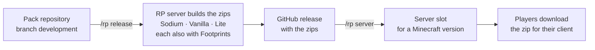

# Documentation

How MCME's resource packs get from a Git repository to the players, and what this repository's converter does along the way.

| I want to… | Read |
|---|---|
| Make a new or existing pack repository ready for the pipeline | [Set up a pack repository](pack-repository.md) |
| Know what happens when I run `/rp release`, step by step | [The release pipeline](release-pipeline.md) |
| Understand exactly how a Sodium pack becomes a vanilla pack | [How generateVanilla converts a pack](conversion.md) |
| Work on shaders, or add a shader feature to a pack | [The shader base](shader-base.md) |
| Fix a failed release, a warning, or a pack players don't get | [Troubleshooting](troubleshooting.md) |
| Add a pack to the automation on the server (admins) | [Add a pack to the automation](server-setup.md) |
| Run the converter on my own computer, or work on its code | The [README](../README.md) |

## The short version

1. **You push** your pack to its `development` branch.
2. **`/rp release <pack> <tag> <title>`** on the RP server builds the zips and publishes them as a GitHub release. For a Sodium pack, this repository's generateVanilla makes the Vanilla and Lite variants from the Sodium variant.
3. **`/rp server <pack> <tag> <Minecraft version>`** points the server at that release. Only then do players get it.

## Words used in these pages

| Word | Meaning |
|---|---|
| **Sodium variant** | The pack as its makers write it. Its 3D models are `.obj` files that only render with the Special Model Loader client mod (on Fabric with Sodium). |
| **Vanilla variant** | Made from the Sodium variant by generateVanilla. Every `.obj` model is baked into a normal block model plus a texture, and objmc's core shaders draw the real shape. Works without mods. |
| **Lite variant** | A Vanilla variant with at most two models per blockstate variant (`--limit 2`). Less variety in the world, but smaller and lighter. |
| **Footprints** | A copy of a variant with the activator rail textures swapped for footprints. |
| **Release repository** | The GitHub repository whose Releases hold the zips. It doesn't have to be the pack's own repository. |
| **Slot** | One Minecraft version's entry for a pack in the server config, such as `26_2`. It holds a download URL and a SHA-1 per zip. |
| **Automation folder** | The folder on the RP server where the release scripts, the server's checkouts of the packs and a checkout of this repository live. |
