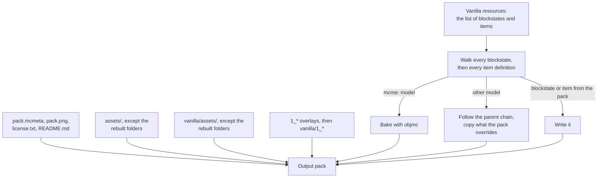

# How generateVanilla converts a pack

Everything generateVanilla does to turn a Sodium pack into its Vanilla (or Lite) variant, in the order it does it. The [README](../README.md#user-manual) explains how to run it. [Set up a pack repository](pack-repository.md) turns this into rules for pack makers.

- [Overview](#overview)
- [1. pack.mcmeta and the top-level files](#1-packmcmeta-and-the-top-level-files)
- [2. Copying assets](#2-copying-assets)
- [3. The vanilla folder and overlays](#3-the-vanilla-folder-and-overlays)
- [4. Walking the blockstates and items](#4-walking-the-blockstates-and-items)
- [5. Models](#5-models)
- [Baking a model with objmc](#baking-a-model-with-objmc)
- [Conversion settings (.objmeta)](#conversion-settings-objmeta)
- [Rotations](#rotations)
- [Shared parents](#shared-parents)
- [Animated textures](#animated-textures)
- [What stops a run, and what doesn't](#what-stops-a-run-and-what-doesnt)
- [Output and logging](#output-and-logging)
- [Speed](#speed)

## Overview

The input pack is only read. Every run adds to the output folder and never deletes from it, so always use a new, empty one.

## 1. pack.mcmeta and the top-level files

- **`pack.mcmeta`** is read from the pack root. The word `Sodium` in `pack.description` becomes `Vanilla` (case-sensitive). Everything else, overlays included, is kept. The description must be a plain string: a text component stops the run. Without a `pack.mcmeta`, the output has none either.
- **`pack.png`, `license.txt` and `README.md`** are copied. No other top-level file is.

## 2. Copying assets

`assets/` is copied as it is, **except** these folders in every namespace, because step 4 rebuilds them from what is used:

| Skipped | Why |
|---|---|
| `blockstates`, `items` | Rewritten from the walk in step 4 |
| `models` | Only models the walk reaches are written |
| `textures/block`, `textures/item` | Only textures those models use are copied |
| `assets/mcme/sml_load_scopes` | Only Special Model Loader reads it |

The rest of `textures/` (`gui`, `entity`, `font` and so on) is copied whole. The `modelengine` namespace keeps its `models` and `items` folders, because its own loader reads them directly.

**Consequence:** a model or a `textures/block` texture that no blockstate or item definition reaches, directly or through a parent, doesn't end up in the output.

## 3. The vanilla folder and overlays

- **`vanilla/assets/`** is copied on top of the output, with the same folders skipped. So `vanilla/assets/*/models` and `vanilla/assets/*/textures/block|item` are never used. Only `vanilla/`'s `blockstates` and `items` play a part, and those are read in step 4.
- **Overlay folders**, the top-level folders whose names start with `1_`, are copied as they are, then `vanilla/1_*` on top of the same name. Their contents are **not converted**: an `mcme:` model inside an overlay isn't baked. A folder named `26_2` or anything else not starting with `1_` isn't copied at all.

## 4. Walking the blockstates and items

The converter doesn't walk the pack. It walks the **vanilla client's** `assets/minecraft/blockstates/*.json`, then `assets/minecraft/items/*.json`, from the vanilla resources folder it is given. For each name, it takes the first of:

1. the pack's `vanilla/assets/minecraft/…` file;
2. the pack's `assets/minecraft/…` file;
3. the vanilla client's own file.

Only files from 1 or 2 are written to the output. A vanilla client's file is only walked, to copy any models and textures the pack overrides somewhere in its chains.

**So the vanilla resources decide what can be converted.** A blockstate for a block that isn't in that version's list is never read and is missing from the output. The same goes for anything outside the `minecraft` namespace. The server uses Minecraft 26.2's resources since October 2026 (1.21.4's before).

**Blockstates:** for `variants`, every value; for `multipart`, every part's `apply`. A value is one model entry or a weighted list of them.

**`--limit N`** (the Lite variant uses 2) cuts every such list down to its first N entries before anything else happens. The written blockstate names only those. Weights aren't changed. Item definitions aren't limited.

**Item definitions:** every `{"type": "model", "model": …}` and `{"type": "special", "base": …}` node is found, however deeply nested, and handled like a blockstate entry.

## 5. Models

Each model entry goes one of two ways:

- **`mcme:` model** → [baked with objmc](#baking-a-model-with-objmc). The entry is pointed at the baked model.
- **any other model** → its parent chain is followed, up to a `builtin/` parent. Each model along the way that the pack has is copied, with every texture it names (plain or `{"sprite": …}`) and the texture's `.png.mcmeta`. A model only the vanilla client has is read, so the chain can continue, but not copied; the textures it names are still copied if the pack has them. A model neither has gives the warning `Missing model file`.

The water and lava flow textures (`water_flow`, `lava_flow` and their `.mcmeta`) are always copied from the pack, used or not.

## Baking a model with objmc

objmc ([original](https://github.com/Godlander/objmc); this repository bundles its own Python port) turns a 3D model into an ordinary block model plus a texture. The texture carries the geometry as pixel data under the real texture. The objmc core shaders in the pack read that data and draw the real shape. **The baked models only render with those shaders**, which is why every Sodium pack has them in `vanilla/`.

For one `mcme:` model entry:

1. **Find the files:**
   - the model JSON `assets/mcme/models/<path>.json`;
   - the `.obj` in its `model` key;
   - the `.mtl` named in `mtl_override`, or else the one with the model's own name;
   - the optional `.objmeta`, with the model's name.
2. **Find the texture:** the `.objmeta`'s `texture`, or else the `.mtl`'s first `map_Kd` line. `mcme:` textures come from `assets/mcme/textures/`, `minecraft:` ones from `assets/minecraft/textures/`.
3. **Rotate**, if the entry has a rotation (see [Rotations](#rotations)).
4. **Run objmc** with the `.objmeta` settings and `--mipmap 4`.
5. **Fit the result into the pack:**
   - the baked model goes to `assets/mcme/models/<path>[suffix].json` and its texture to `assets/mcme/textures/<path>[suffix].png`;
   - the texture is also the model's particle texture;
   - `display`, `gui_light` and every `tintindex` are removed, so **baked models aren't biome-tinted**.
6. **Share the geometry**, if the `.obj` is a shared parent (see [Shared parents](#shared-parents)).

A model whose JSON has no `model` key, or whose `.obj` is missing, is skipped **without any message**. A model that fails, for example because of a missing `.mtl` or texture or an objmc error, is skipped with a warning. Either way, **the blockstate still names the model**, so the block shows as a missing model in game.

**What the baked texture looks like:**
- **Width:** the same as the source texture's. It must be at least 8 pixels.
- **Height:** rounded up to a power of two. It is always taller than the source, because the geometry data is stored in the texture along with the picture. A simple model with a 16×16 texture bakes to 16×128, and one with a 512×512 texture to 512×1024. More faces make it taller.
- **Mipmapping:** the picture starts on a 16-row boundary, padded with repeated edge rows. This needs the matching shaders: RP-Human's from commit `621c00c3d` (1 October 2026) or later.
- **Transparent pixels** get the colour of their nearest visible neighbour (with alpha still 0), so edges don't turn dark at a distance.
- **Edges:** if every pixel is fully transparent or fully opaque, the shader draws crisp cut-out edges. One pixel with partial transparency makes the whole texture render with soft edges.

**objmc's limits:**
- Every vertex must stay within ±128 blocks of the model's origin.
- UVs outside 0–1 are clamped.
- Faces with more than four corners use only the first four.
- objmc's own warnings about these are not shown when the bake succeeds, so check odd-looking models in the source.

## Conversion settings (.objmeta)

A YAML file next to the model JSON, with the same name. Every key is optional.

| Key | Default | Effect |
|---|---|---|
| `texture` | the `.mtl`'s `map_Kd` | The texture to bake from: `mcme:block/x`, or `minecraft:block/x` for one in the pack's own `assets/minecraft/textures/` (not the vanilla client's) |
| `output_texture` | the model's path | Name of the baked texture, under `assets/mcme/textures/` |
| `offset` | `-0.5 0.0 -0.5` | Moves the model before baking. **Three numbers in one string**, separated by spaces. A YAML list stops the run. |
| `options` | none | `noshadow` turns off face shading. `flipuv` is for a texture that comes out upside down. Nothing else is recognised. |
| `visibility` | `7` | Where the model shows, as a sum: 4 in the world, 2 in the hand, 1 in the GUI |
| `omnidirectional_parent` | `false` | For a shared parent `.obj` only: the model looks the same from every side, so all its rotations share one parent |

- **The old `parent` key is ignored.** Since the parent rework, sharing comes from the `.obj`'s name.
- **A `.objmeta` with a YAML error is reported and ignored**: the defaults are used.
- **An empty `.objmeta` stops the run.** Delete it instead.

## Rotations

A blockstate entry's `x`, `y` or `z` rotation is baked into the model:

- **Only one axis.** The first of `x`, `y`, `z` is used. The others are dropped with the warning `Multiple rotations`.
- **The rotation must be a number.**
- **Each rotation is a separate bake** with a suffix: `pine_leaves_y_90`. Even `y: 0` makes its own `_y_0` bake.
- **The `.obj` is rotated around the block's centre** (0.5, 0.5, 0.5) in a temporary copy. The pack's file isn't touched.

## Shared parents

Many models use the same shape with different textures. The Vanilla variant can store that shape once, as a parent model, so the pack stays smaller.

- **Which `.obj` is shared:** one whose name is `parent`, or ends in `_parent`, optionally followed by `_<number>`. `leaves_parent.obj`, `leaves_parent_2.obj` and `parent.obj` are shared parents; `leaves_parent_1_2.obj` is not.
- **The parent model** is written as `assets/mcme/models/<path of the .obj>.json`. `leaves_parent.obj` gives `leaves_parent.json`. Each model that shares it gets its own small model JSON with `parent` and its own texture.
- **Rotations:** models baked with a `y` rotation of 90, 180 or 270 share a separate parent per angle: `leaves_parent_1_2`, `_1_3`, `_1_4`. If the name already ends in a number, the angle goes after it: `leaves_parent_2_2`. With `omnidirectional_parent: true`, every rotation shares the one parent.
- **Same texture size:** the geometry in a baked texture depends on the texture's size, so only models whose bakes are the same size can share.

> [!WARNING]
> **Make every texture used with one parent `.obj` the same size.** When sizes differ, you get the warning `… shares parent group … but its baked texture is …`. The current code then has a bug: a later model of the second size can overwrite the parent file that the models of the first size still use. Their geometry is then wrong in game. Which models are hit depends on the order in which files are processed, so it can change between runs. Treat this warning as an error.

## Animated textures

A texture with a `.png.mcmeta` that has an `animation` section is treated as a flipbook:

- **Frame size:** the `.mcmeta`'s `width` and `height`. With neither, square frames as wide as the sheet's shorter side; with only one of them, the other is the sheet's full size.
- **The sheet must divide evenly into frames.** If it doesn't, you get a warning and the model is baked **without** animation.
- **Fewer than two frames** counts as no animation.
- **objmc bakes the model once, then the bake is repeated for every frame**, each copy with that frame's picture, and stacked into one tall texture. Frames are read left to right, then top to bottom, so grid sheets work.
- **The output `.mcmeta`** is a copy of yours with the frame size of the bake. Frame numbers past the end of the sheet are dropped, and `interpolate` is turned off. You get a `Note:` line for each.

## What stops a run, and what doesn't

**A problem with one model or file normally doesn't stop the run.** It prints a warning, skips that model or file, and carries on. Read the warnings after every run. The table in [Troubleshooting](troubleshooting.md#generator-warnings) lists them all.

**These stop the run with a Python error (exit code 1)**:
- invalid JSON in any blockstate, item definition or model the walk reaches, or in the `.png.mcmeta` of a texture that gets baked;
- a text-component pack description;
- an empty `.objmeta`, or an `offset` that isn't three numbers in a string;
- a missing input pack folder.

A missing or wrong **vanilla resources** folder doesn't stop anything: the walk finds no blockstates or items, writes none, and the run ends normally. Check the folder if a Vanilla variant comes out with none.

The release scripts don't stop when the converter does: the zip of a half-converted pack still gets made and uploaded. On the RP server, the run summary flags it (a `Traceback`, and usually an empty or much smaller zip).

**Exit codes:** 0 when the run gets to the end, even with warnings and failed models. 1 for a Python error. 2 for wrong command line arguments.

## Output and logging

- **With `--debug`**, every step is printed: every blockstate and item, every model converted, copied or read, every texture copied, every shared parent and flipbook. That's about 120,000 lines for Human.
- **`debug.log`**, in the folder you run from, gets the same lines plus Pillow's own image-reading messages. It is overwritten on every run.
- **Warnings go to the console only**, not to `debug.log`.
- **`--compress`** writes blockstates, item definitions and baked models without indentation. `pack.mcmeta` and `.mcmeta` files stay indented.

## Speed

Everything runs one after another. Baking dominates: every model entry is a separate objmc run of roughly 50 to 100 ms for a normal texture, more for big ones (about 1¼ s for 1024×1024). A model used by several blockstates is baked again for each one. A Human Vanilla variant (about 2,200 bakes) takes about 3½ minutes on the RP server; Lite takes about 2.
