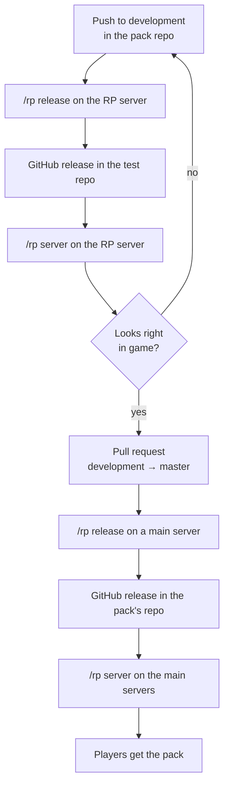
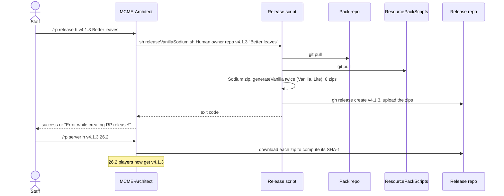
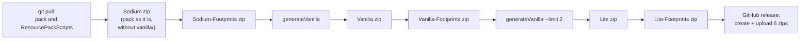

# The release pipeline

What happens between `/rp release` in game and a player downloading the new pack. If your pack isn't in the pipeline yet, read [Set up a pack repository](pack-repository.md) first.

- [Two stages: test, then production](#two-stages-test-then-production)
- [1. Before you release](#1-before-you-release)
- [2. Start the release in game](#2-start-the-release-in-game)
- [3. The plugin starts the release script](#3-the-plugin-starts-the-release-script)
- [4. The pipeline wrapper (RP server only)](#4-the-pipeline-wrapper-rp-server-only)
- [5. The release script, step by step](#5-the-release-script-step-by-step)
- [6. The result](#6-the-result)
- [7. Put the release on a server](#7-put-the-release-on-a-server)
- [8. Players get the pack](#8-players-get-the-pack)
- [How long a release takes](#how-long-a-release-takes)

## Two stages: test, then production

Every pack goes through the same steps twice. Once on the **RP server**, which is the test stage. Then once on a **main server** such as mainworld or moria, which is production.

| | Test: the RP server | Production: the main servers |
|---|---|---|
| Pack branch that is built | `development` | `master` |
| ResourcePackScripts branch used | `development` | `master` |
| Where the GitHub release goes | A test repository, such as `EriolEandur/RP-Gondor` for Human | The pack's own repository, such as `MCME/RP-Human` |
| Who gets the pack | Players on the RP server | Players on the servers whose slots you update |
| Pipeline wrapper (lock, run log, summary) | Yes | Not yet |



The rest of this page follows one release through the steps. They're the same on both stages, except where a step says otherwise.



Two commands, two separate decisions:

- **`/rp release`** builds the zips and publishes them as a GitHub release. Nobody gets them yet.
- **`/rp server`** points a Minecraft version's slot at a release. From then on, players get that release.

So you can look at a release before it reaches players, and going back to an older release is a single `/rp server` command.

## 1. Before you release

- **Push your work to the branch the stage builds from**: `development` for the RP server, `master` for production. The server runs `git pull` on that branch at the start of every release. Work that is only on your computer, or on another branch, isn't in the release.
- **Pick a new version tag**, for example `v4.1.4`. It becomes part of every download URL, so use only letters, digits, dots and dashes. Keep it short: the plugin stores each player's pack URL in a 100-character column, and today's longest URLs are already 96 characters.
- **Use a new tag for every release.** Reusing a tag replaces that release's zips, except for vanilla-only packs on production, where the upload fails (see [Re-running a release](troubleshooting.md#re-running-a-release)).
- **Optional but recommended:** run the conversion on your own computer with generateVanilla (see the [README](../README.md#generate-the-vanilla-pack)) and read the warnings. The server runs the same code.

## 2. Start the release in game

```
/rp release <pack> <version tag> <release title>
```

| Part | Example | Notes |
|---|---|---|
| `<pack>` | `h` or `Human` | The pack's name in the server's config, or the start of it. The server takes the **first** pack in its config whose name starts with what you typed, ignoring case: `h` is Human, `m` Mordor, `d` Dwarven, `r` Rohan, `l` Lothlorien, `p` Paths of the Dead. |
| `<version tag>` | `v4.1.3` | The Git tag of the release, and part of every download URL |
| `<release title>` | `Better leaves` | The title of the GitHub release. Everything after the tag counts, spaces included. |

- **You need the permission `architect.resourcePackAdmin`.** The command also works from the server console.
- **Run it on the server of the stage you want**: the RP server for a test release, a main server for production.
- **The build runs in the background.** Its output scrolls through that server's console, not through your chat. You get one chat message when it ends (see [The result](#6-the-result)).

## 3. The plugin starts the release script

MCME-Architect looks the pack up in the `gitHubRpReleases` section of its config (see [Add a pack to the automation](server-setup.md)). That gives:

- **the script** that builds the pack:
  - `releaseVanillaSodium.sh` for a Sodium pack, which makes six zips;
  - `releaseGeneral.sh` for a vanilla-only pack, which makes two;
- **the GitHub repository** that gets the release (owner and repo);
- **the automation folder** the script runs in.

It runs `sh <script> <Pack> <owner> <repo> <tag> <title>` in that folder and waits.

> [!IMPORTANT]
> The plugin waits **5 minutes**. A release that takes longer still finishes, but the chat message says `Process terminated=false`. Human takes a little over 5 minutes, so every Human release shows it. See [Error messages in game](troubleshooting.md#error-messages-in-game).

## 4. The pipeline wrapper (RP server only)

On the RP server, the release scripts don't run on their own. Their first lines hand over to a wrapper, which runs the script and adds three things:

- **A lock.** Every release script builds in the same `release/` folder, so two releases at once would mix their files. While one release is running, the wrapper refuses a second and starts nothing. The console says which release is running, and the chat message shows `exitCode=75`. Run `/rp release` again once the first one has finished.
- **A log of every run.** Every output line is kept with a timestamp. The generator's `--debug` lines (about 120,000 per Human release) go only to the full log. Everything else still reaches the server console. Full logs are kept for the last 30 runs, the console part for the last 200, summaries for good.
- **A summary of every run.** It records the steps and how long each took, every zip with its file count, warnings, errors, the GitHub release URL and a status:

| Status | Meaning |
|---|---|
| `ok` | Finished, with no warnings and no problems |
| `warnings` | Finished, but the generator printed warnings. Normal for Human and Mordor; read them anyway. |
| `failed` | An error line, or a problem with a zip or the GitHub release (see below) |
| `interrupted` | The run was cut off, for example by a server restart. The next release tidies up after it. |

The summary flags these problems even when the script ended with exit code 0:

- a zip that 7-Zip didn't finish, or that is **empty**;
- a zip with **under 90 %** of the files the same zip had in the pack's last good release, which usually means the conversion broke half-way;
- **no GitHub release** created.

The verdict is the `Release run …` line near the end of the run's console output, followed by one line for each problem. For example:

```
Release run 20260930-050612-Human-v4.1.3: OK with warnings. 10 warning(s), 0 error(s). Human-Sodium.zip 16,075 files, ...
```

Staff with access to the admin dashboard can read every run there, with its steps, warnings and full log, on the **Resource packs** page.

> [!NOTE]
> Production releases don't have the wrapper yet. Two production releases at the same time can spoil each other, so agree in the team who releases when.

The release scripts and the wrapper live on the server, not in this repository. This repository holds the converter they call.

## 5. The release script, step by step

### Sodium packs: `releaseVanillaSodium.sh` (six zips)

Used by Human and Mordor. `<Pack>` is the pack's name in the config, for example `Human`. The server's checkout of the pack is the folder `<Pack>-Sodium`.

| Step (console line) | What happens | Output |
|---|---|---|
| `compiling <Pack> RP zips` | Start | |
| `<Pack>-Sodium` | `git pull` in `<Pack>-Sodium`, then `git pull` in ResourcePackScripts. The pack is copied to `release/` and zipped as it is, **without** its `vanilla/` folder. The shader base is already in the repository, written by [the sync](shader-base.md#getting-it-into-a-pack). | `<Pack>-Sodium.zip` |
| `<Pack>-Sodium-Footprints` | The footprints texture is copied over `activator_rail.png` and the folder is zipped again. | `<Pack>-Sodium-Footprints.zip` |
| `<Pack>-Vanilla` | `release/` is emptied, then generateVanilla converts the Sodium pack into it. | `<Pack>-Vanilla.zip` |
| `<Pack>-Vanilla-Footprints` | Both footprints textures (`activator_rail.png`, `activator_rail_on.png`) are copied in and the folder is zipped again. | `<Pack>-Vanilla-Footprints.zip` |
| `<Pack>-Lite` | `release/` is emptied, then generateVanilla runs again with `--limit 2`: at most two models per blockstate variant. | `<Pack>-Lite.zip` |
| `<Pack>-Lite-Footprints` | Footprints again | `<Pack>-Lite-Footprints.zip` |
| `releasing <Pack> RP zips` | `gh release create <tag>` in the release repository, with your title and the notes "Version `<tag>` for MC 1.21.4" (fixed text, whatever the real version). Then `gh release upload` of all six zips, and the release URL is printed. | GitHub release |



### Vanilla-only packs: `releaseGeneral.sh` (two zips)

Used by Rohan, Lothlorien, Dwarven and, for now, Paths of the Dead. There's no conversion: the pack is zipped as it is. The server's checkout is the folder `<Pack>-Vanilla`.

| Step | What happens | Output |
|---|---|---|
| `compiling <Pack> RP zips` | `git pull` in `<Pack>-Vanilla`. The pack is copied to `release/` and zipped, leaving out any `inventories` folder. | `<Pack>.zip` |
| (no console line) | Both footprints textures are copied in and the folder is zipped again. | `<Pack>-Footprints.zip` |
| `releasing <Pack> RP zips` | `gh release create`, then `gh release upload` of both zips | GitHub release |

### Details that matter

- **The server builds whatever is on its checkout's branch after `git pull`.** If the pull fails, for example on a merge conflict, the script carries on with the old files. On the RP server the run then shows an error and the status `failed`, but the zips may still have been uploaded. Check a failed run before you use its release.
- **Files and folders at the top of the repository whose names start with a dot** (`.git`, `.gitignore`, `.github`) never end up in a zip. Deeper down they do, so don't commit `.DS_Store` and the like.
- **Everything else at the top of your repository goes into the Sodium zip and the vanilla-only zips**: `README.md`, `changelog.txt`, `blockList.txt` and so on. Keep the top level tidy.
- **ResourcePackScripts is pulled at the start of every Sodium release.** A change merged into `development` here is used by the next test release; a change merged into `master` by the next production release.
- **The converter walks Minecraft 1.21.4's blocks and items.** Blocks added in later versions are dropped from the Vanilla and Lite zips. See [Known limits](pack-repository.md#known-limits).

## 6. The result

**In game**, the plugin sends one message when the script ends:

- the success message if the script ended within 5 minutes with exit code 0;
- otherwise `Error while creating RP release! Process terminated=<true|false> exitCode=<n>`. That doesn't always mean it failed: see [Error messages in game](troubleshooting.md#error-messages-in-game).

**On GitHub**, the release appears at `https://github.com/<owner>/<repo>/releases/tag/<tag>` with its zips.

**For the real verdict**, read the wrapper's summary on the RP server: the `Release run …` line near the end of the run, or the dashboard's Resource packs page. On production, read the console output and check that the release has all its zips.

## 7. Put the release on a server

```
/rp server <pack> <version tag> <Minecraft version>
```

For example `/rp server h v4.1.3 26.2`. You need `architect.resourcePackAdmin`.

1. The plugin writes the download URL of every zip of that release into its config, in a **slot** for that Minecraft version. Dots become underscores, so `26.2` is the slot `26_2`. The zip names it writes depend on the pack's config:
   - for a Sodium pack, `<Pack>-Vanilla.zip`, `-Vanilla-Footprints`, `-Sodium`, `-Sodium-Footprints`, `-Lite` and `-Lite-Footprints`;
   - otherwise, `<Pack>.zip` and `<Pack>-Footprints.zip`.
2. It saves the config.
3. It downloads each zip of the **newest** slot once and stores its SHA-1. Minecraft checks every download against it. To hash every slot instead, use `/rp calcsha <pack> all`.

> [!WARNING]
> **Type the Minecraft version exactly**: `26.2`, `1.21.4`. The plugin only knows the versions listed in its protocol table. A version it doesn't know, such as `26.2release`, still gets saved as a slot. After that, every later `/rp server` for that pack fails without a word in chat, and **no player gets that pack** until an admin removes the bad slot from the config.

**Several servers share one config file.** mainworld, moria, freebuild, plotworld, themedbuilds, pvpserver and terrain share one; hub, eventserver and the RP server each have their own. `/rp server` on one server writes the shared file, but the other servers keep their old copy in memory. Either run `/rp server` on each of them, or run it on one and then `/architect reload` on the others. Never run `/rp server` for one pack on a server that hasn't reloaded since another pack changed: it writes its old copy of the whole file back.

## 8. Players get the pack

**Which pack.** The server gives each area its pack through RP regions, which staff draw with `/rp create`. When a player with automatic switching on (the default) walks into a region, they get that region's pack. Players can also pick a pack with `/rp <pack>`, for example `/rp h`.

**Which zip.** Within a pack, the plugin picks:

- **the client type**:
  - `sodium` for players who join with the MCME modpack;
  - `vanilla` for any client that isn't Fabric;
  - `lite` only when chosen with `/rp client lite`. That choice is kept over a rejoin only on a plain Fabric client.
- **the variant**: `light` (the normal pack), or `footprints` with `/rp variant footprints`;
- **the slot**: the newest slot whose Minecraft version is not newer than the player's. A 26.2 player gets `26_2`, and a 1.21.4 player gets `1_21_4` if the pack still has it, otherwise the newest older slot.

If the pack has nothing for the player's choice, for example a Sodium player in a vanilla-only pack, the first option listed in the config is used.

**When.** Players get a new zip:

- when they join the network;
- when they walk into a different RP region;
- when they use `/rp <pack>`, `/rp reset`, `/rp client` or `/rp variant`.

**Nothing pushes a new release to players who are already online.** After `/rp server`, they get it on their next join or region change. `/rp <pack> -force` resends the pack to **you** only, even if the URL hasn't changed. It's handy for checking a release yourself.

## How long a release takes

Measured on the RP server in September and October 2026:

| Pack | Script | Whole release | Vanilla step | Lite step |
|---|---|---|---|---|
| Human | `releaseVanillaSodium.sh` | 5 min 10 s – 5 min 40 s | about 3½ min | about 2 min |
| Mordor | `releaseVanillaSodium.sh` | about 2 min 15 s | about 1 min 20 s | under 1 min |
| Paths of the Dead | `releaseGeneral.sh` | a few seconds | | |

Almost all the time goes to generateVanilla baking the `.obj` models with objmc, once for Vanilla and once for Lite. Zipping and uploading take seconds.
