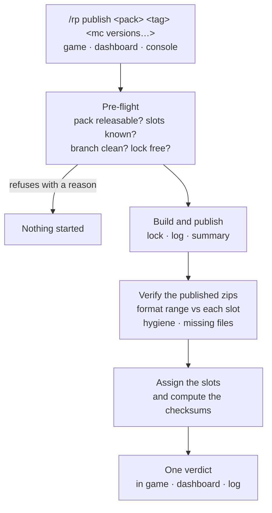

# Reworking the release process — scope

> [!IMPORTANT]
> **Status: proposal.** Nothing in this document is built. It exists to agree the shape and the size of the work
> before any of it starts.

[The release pipeline](release-pipeline.md) and [Troubleshooting](troubleshooting.md) describe the process as it is
today — including a number of caveats readers are asked to work around: production has no wrapper, so agree in the
team who releases when; the in-game message is only trustworthy if the script finished inside five minutes; for the
real verdict, go and read the summary somewhere else. Those pages are accurate. This page is about removing the need
for the workarounds.

## Why now

A single test release of the Human pack on 2026-10-09 finished correctly — the zips built, the GitHub release was
created, players who received the pack loaded it — and still produced all of the following:

- a `failed` verdict that was not a failure, on a check that **cannot clear itself** (see A3);
- six server slots left with a download URL and **no checksum**, silently, so the pack could not be served;
- an invalid per-player setting written by a mistyped command that reported no error;
- one player unable to get any pack at all, with an error message that named the wrong cause, for about six hours,
  until a scheduled restart fixed it;
- four warnings about packs being "short" that were caused by a deliberate optimisation committed eight days earlier.

None of that was the release. All of it was the process around the release.

## What already works, and should not be rebuilt

The pipeline wrapper is sound. It gives one release at a time with a real lock, a timestamped log of every line, a
recovery path for a run that was cut off, per-run summaries with step timings and per-zip counts, log retention, a
record of refused attempts, and attribution of a run to the person who started it. Everything proposed below builds on
it.

## Where the pieces live

The process spans three code bases. Any plan has to say which part it touches, because they are owned and released
separately.

| Component | Lives in | Owns |
|---|---|---|
| The converter (`generateVanilla`, objmc) | **this repository** | How a Sodium pack becomes Vanilla and Lite |
| The release scripts and the pipeline wrapper | the server's automation folder | Building the zips, publishing them, the log, the lock, the summary and its verdict |
| The `/rp` commands, slots and pack selection | MCME-Architect (plugin) | Starting a release, assigning a slot, checksums, choosing which zip a player gets, every message a player sees |

A good share of the problems below are in the plugin. That is worth knowing before committing to a timeline.

## The problems

### A. The verdict is not trustworthy

**A1. A published release is reported as `failed`.** The status is a single value mixing two different questions: did
the release publish, and do the checks like what they see? A release that published, exited 0 and logged no errors is
reported as `failed` when a file-count heuristic fires. Staff who see `failed` on a release that plainly worked learn
to ignore the field, which costs us the one signal we have.

**A2. The shrink check's assumption is wrong as often as it is right.** It reads "under 90 % of the last good release
usually means the conversion broke half-way". It can equally mean the converter got better. On 2026-10-01 the commit
`fac86f4 feat(objmc): Store each bake's texture once` began storing each bake's texture once instead of once per bake.
The next release's own log says what that saved: `Merged 1991 objmc bakes holding the same texture into 166 sprites`
for the Vanilla pass (1,825 files) and `Merged 1330 … into 114` for the Lite pass (1,216 files). The observed drops
were 1,818 and 1,169. Nothing was lost: the newer zip contains every file the older one had, plus new shader files.

**A3. The check cannot clear itself.** A zip under the limit is recorded as a *problem*; any problem makes the run
`failed`; and the baseline is taken from the pack's last run that did **not** fail. So a flagged run can never become
the next baseline. The reference has been frozen on one release since 2026-10-02, every release since has failed in
exactly the same way, and it will keep doing so for every future release. Ratios against that frozen reference:
Vanilla 87.5 %, Vanilla-Footprints 87.5 %, Lite 88.3 %, Lite-Footprints 88.4 %, Sodium 100.2 %.

**A4. The checks that would catch real breakage do not exist.** Nothing compares a published zip's
`pack.mcmeta` format range against the Minecraft versions of the slots it will be served to. That mismatch is exactly
how a whole Minecraft version's worth of players were served a pack their client refused, with no warning anywhere in
the pipeline. Nothing checks that a slot has a checksum. Nothing reports the pack-hygiene problems the converter
already knows about — a blanket `entity` directory source in the items atlas puts 22 of the pack's sprites into two
atlases at once, which clients warn will be rejected by a future Minecraft version.

### B. Starting a release gives no guidance

**B1. Only a player can start one.** The commands are refused for any non-player sender, so nothing about a release
can be started from the dashboard, from a script, or from the console, and nothing can be scheduled.

**B2. The syntax line is the only guidance.** It does not say which packs can be released, that a release assigns the
pack to no server at all, or that two further commands must follow it in order. A releaser who stops after
`/rp release` has published a release that reaches nobody, and nothing says so.

**B3. A mistyped pack name can quietly change a setting instead.** Sub-commands are matched exactly and anything else
falls through to prefix-matching a pack name, so a single letter that happens to begin a sub-command's name writes a
value into the player's own settings and reports success.

### C. The outcome does not reach the person who asked

**C1. The in-game message is a guess.** The plugin waits five minutes and reports success only if the script finished
inside that window; a Human release regularly takes longer, so the normal outcome for the biggest pack is a message
that reads like a failure. The release may have gone perfectly.

**C2. The real verdict lives somewhere the releaser is not.** It is a line in the run's console output and a row on a
dashboard page. The person who typed the command gets neither.

**C3. Finding out why a pack was not served is far harder than it should be.** When pack selection fails, the message
names a missing URL regardless of the actual cause — a missing slot, a missing checksum, a client the pack has no
entry for, or stale per-player state. Diagnosing it needs a debug switch whose command is easy to confuse with a
similarly named one, whose default level prints nothing, and whose output goes to the server log rather than the
plugin's own.

### D. Pack selection is fragile

**D1. One unrecognised version key disables a whole pack.** When a slot name is not a known Minecraft version, the
search stops and returns nothing instead of skipping that entry, so a single typo silently stops every player getting
that pack. A mistyped slot name also cannot be repaired in game: it breaks every later slot command for the pack
until the config is edited with the server stopped.

**D2. A player can be stuck for as long as the server runs.** The client's protocol version is cached per player and
only re-read when it is exactly zero, so one bad value survives reconnects and makes every slot fail its version
comparison. The only cure found was a restart.

**D3. A slot can be written without a checksum.** Assigning a release to a slot writes the URL and leaves the
checksum empty until a separate command is run. Between the two, the slot is unusable, and nothing warns.

### E. The two release systems drift, and are kept in step by hand

**E1. Production has no wrapper, and a dozen servers can start one.** Production releases have no lock, no log, no
summary and no dashboard page. Worse than "two people might clash": every server except the test one is configured to
release into the *same* production folder, and every release script builds in the same directory inside it. So there
are twelve entry points into one unsynchronised build directory, and the documentation can only ask the team to
coordinate by hand.

**E2. There is no promotion step.** Moving a tested release to production means repeating the work against different
repositories and slots by hand. The two sides are currently serving different builds of the same pack, with no
mechanism that would have shown the divergence.

**E3. The release scripts are not in version control, and the two copies have drifted in behaviour.** Each automation
folder holds its own hand-edited copy of every release script. They are not in any repository, so there is no history,
no review and no way to tell an intentional difference from an accident. Two of the current differences change what a
release does, not where it goes:

| Script | Production | Test |
|---|---|---|
| the Sodium/Vanilla release script | runs the converter without `--debug` | runs it with `--debug` |
| the general release script | `gh release upload …` | the same, plus `--clobber` |

The first means a production release produces none of the detailed converter log — and the pipeline's full log is
built from exactly those lines, so installing the wrapper on production without this flag would give an empty log.
The second means re-uploading to an existing tag overwrites the asset on test and fails on production.

Nothing else in those scripts is environment-specific: the owner, repository, tag and title all arrive as arguments
from the plugin's per-pack configuration. **The two copies could be byte-identical** apart from the wrapper hand-over,
which both should have. That makes this drift avoidable rather than inherent.

**E4. A pack can be releasable from one side only.** One release script exists in the test automation folder and not in
the production one, so that pack cannot be released to production at all until somebody notices and copies the file.

**E5. A leftover automation folder that nothing uses.** One server has its own automation folder — a pack checkout, a
stale build directory, two published zips and a single release script, all last touched in July 2025. Nothing refers
to it: that server's release configuration points at the production folder like every other server's, and the pack
in the folder appears in no release configuration and no slot anywhere.

It is worth stating the rule it breaks, because it is the simple one: **a server that only hosts packs needs slots,
not scripts.** Building a release is the job of the release server; hosting it is a URL and a checksum in a slot.
Any automation folder outside the two release systems is leftover by definition, and 109 MB of it has sat there for
fifteen months looking like a third system.

**E6. Every release script writes the wrong Minecraft version into every release.** All of them, on both sides,
hardcode the release note as `Version <tag> for MC 1.21.4`. Every release published since the network moved to a newer
Minecraft version carries that text on GitHub, where pack authors and players read it. Nothing generates it from the
version actually being released.

**E7. The two sides deliberately track different branches, and the gap is invisible.** The test folder's converter
checkout follows `development`; the production one follows `master`. That is the right design — test proves
`development` before it reaches players — but there is no view of how far apart they are. At the time of writing
`master` is **9 commits** behind `development`, including a Minecraft version update and the shared shader base. The
only way to learn that is to run `git log` in two directories on the server.

## Principles for the rework

1. **One action, three surfaces.** A release can be started from game, dashboard or console, and behaves identically.
2. **Guidance where the work happens.** The command that starts a release says what can be released and what must
   follow; the command that assigns a slot refuses a name it does not recognise.
3. **Separate "did it publish" from "what do the checks think".** Never report a published release as failed.
4. **Every check must be acceptable once, with a reason.** A deliberate change is recorded and the baseline moves on.
5. **Check what actually breaks players**: format range against slot version, checksum present, slot name known.
6. **Make the happy path atomic.** Release, verify, assign and checksum as one action; keep the single-step commands
   for repair.
7. **The same pipeline on both sides**, with promotion as an explicit, logged step.

## Proposed shape

## Work breakdown

Sized by where it lives, because that decides who can do it and when.

| # | Work | Lives in | Notes |
|---|---|---|---|
| 1 | Split the verdict into outcome + checks; demote a shrink to a warning; let the baseline advance; add an explicit accept-with-reason | wrapper | Removes A1–A3. Self-contained. |
| 2 | Add the checks that matter: format range vs slot version, checksum present, atlas hygiene, missing-file counts | wrapper (+ converter for hygiene) | Removes A4. Needs a small amount of converter output. |
| 3 | Pre-flight: refuse unknown slot names and unreleasable packs before anything runs | plugin | Removes D1's repair problem and part of B2. |
| 4 | In-game verdict when the run ends; stop claiming an exit code that was not observed | plugin + wrapper | Removes C1, C2. |
| 5 | Allow console and dashboard to start a release and assign slots | plugin | Removes B1; makes 7 possible. |
| 6 | One atomic publish action | plugin + wrapper | Removes B2, D3. |
| 7 | Resolution robustness: skip unknown keys instead of stopping; re-read an implausible cached protocol; name the level that failed; let a player clear their own state | plugin | Removes C3, D1, D2. |
| 8 | Install the wrapper on production; add an explicit promotion step | wrapper | Removes E1, E2. Needs 9 first. |
| 9 | Put the release scripts in this repository and install them to every automation folder from one source | **this repository** | Removes E3–E7. The root cause of the drift. |

Items 1, 2, 8 and 9 need no plugin change. Items 3–7 are plugin work.

Item 9 is the one piece of this that belongs in **this** repository, and it is a prerequisite for 8: the
wrapper cannot be installed on production correctly while the script it has to hook into is a hand-edited
copy that differs from the tested one.

## Open questions

- **Order.** Items 1 and 2 are the cheapest way to make the existing signal trustworthy. Item 8 is the only one that
  fixes a current correctness risk rather than a usability one, because production genuinely has no release lock.
- **How much belongs in the plugin at all.** Items 4, 5 and 6 would be much simpler if the plugin's job ended at
  "start this release and tell me the run id", with the pipeline owning verification, assignment and the verdict.
  That is a bigger decision than any single item here.
- **Whether the converter should fail a release.** It currently warns about missing models and pack hygiene and
  carries on. Some of those warnings describe packs that will break on a future Minecraft version.
- **What a verdict should say to a non-technical releaser**, as opposed to what it should record for a maintainer.
