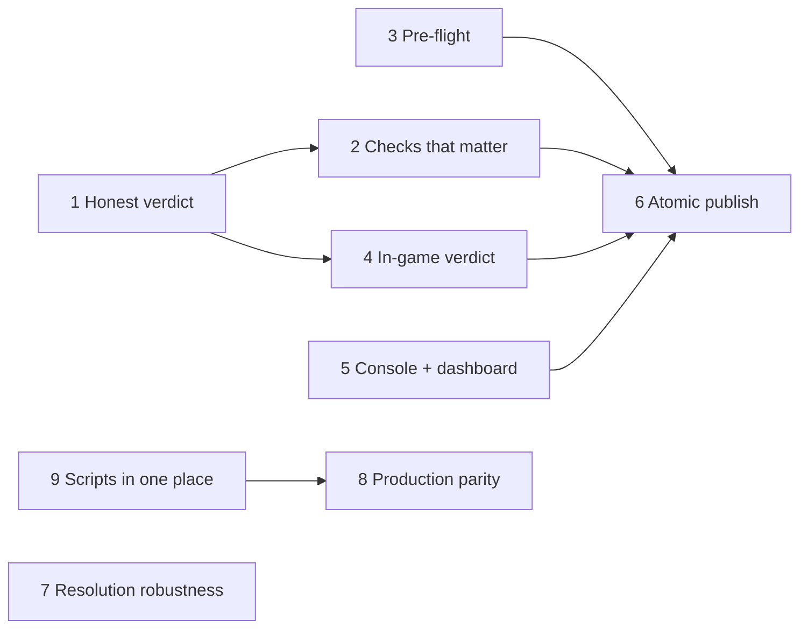

# Release process rework — issues

> [!NOTE]
> Nine issue-ready entries for the work breakdown in
> [Reworking the release process](release-process-rework.md). Each is written to be copied into a GitHub issue as it
> stands. The letters in **Problem** refer to that document's sections.
>
> Nothing here is built. No issue has been opened yet.

**Order.** 1 and 2 are self-contained and make the existing signal trustworthy; do them first. **9 is the prerequisite
for 8**, and together they are the only items that fix a correctness risk rather than a usability one: production has
no release lock today, and its release scripts are hand-edited copies that already differ in behaviour from the tested
ones. 3 unblocks 6. 4 needs the verdict contract from 1. 5 unblocks a dashboard-driven release. 7 is independent.

**Sizes** are rough: S = under a day, M = a few days, L = more than that or needs a design decision first.

---

## 1. Report a published release honestly, and let the baseline move on

**Lives in:** the pipeline wrapper · **Problem:** A1, A2, A3 · **Size:** M · **Blocks:** 2, 4

A release that published, exited 0 and logged no error line is reported as `failed` when a file-count heuristic fires.
The heuristic assumes a smaller zip means a broken conversion; it equally means the converter improved. Worse, a
flagged run is never eligible to become the next baseline, so once a pack trips the check every later release trips it
in exactly the same way, forever.

**Scope**
- Record the outcome of the run (published / not published / interrupted) separately from what the checks think
  (ok / warnings / problems).
- Demote a zip below the shrink limit from a problem to a warning. Keep an empty zip, a zip 7-Zip did not finish, and
  a missing GitHub release as problems.
- Take the baseline from the pack's previous *completed* run rather than its last non-failing one.
- Let a maintainer accept a new baseline once, with a reason and their name, recorded in the summary.

**Acceptance criteria**
- [ ] A run that published, exited 0 and logged no error line is never reported as `failed`.
- [ ] The summary carries outcome and checks as separate fields, and the dashboard shows them distinctly.
- [ ] Two consecutive runs with the same legitimate drop: the second compares against the first, not against an older
      release, and does not repeat the warning.
- [ ] An accepted baseline is recorded with a reason and who accepted it, and appears in the summary.
- [ ] Empty zip, unfinished zip and missing release are still problems, with the existing messages.
- [ ] Re-reading the existing run history produces corrected verdicts, or history is deliberately left as-is and that
      choice is documented.
- [ ] The 2026-10-09 Human release, replayed, comes out as published with warnings.

**Out of scope:** adding new checks (issue 2).

---

## 2. Check the things that actually stop players getting a pack

**Lives in:** the pipeline wrapper, plus a little converter output · **Problem:** A4 · **Size:** M · **Needs:** 1

Nothing compares a published zip's supported Minecraft format range against the versions of the slots it will be
served to. That mismatch is how an entire Minecraft version's players were served a pack their client refused, with no
warning anywhere in the pipeline. Nothing checks a slot has a checksum. The converter already knows about pack-hygiene
problems and missing files, and nobody reads them.

**Scope**
- Read each published zip's `pack.mcmeta` and record its format range in the summary.
- Compare that range against the Minecraft version of every slot the zip is or will be served from.
- Verify every slot of the released pack has a checksum, and that it matches the published asset.
- Surface the converter's existing missing-model and missing-texture warnings as counts.
- Flag an atlas source that places a sprite into two atlases at once.

**Acceptance criteria**
- [ ] The summary records `min_format` and `max_format` per zip.
- [ ] A zip whose format range does not cover a slot's Minecraft version is a problem, naming the zip, the range and
      the slot.
- [ ] A slot with a download URL and no checksum is a problem, naming the slot.
- [ ] A slot whose checksum does not match the published asset is a problem.
- [ ] Known-bad case is caught: a pack supporting only one Minecraft version, assigned to a newer version's slot.
- [ ] Known-good case is not flagged: a pack whose range spans two Minecraft versions, assigned to both their slots.
- [ ] Missing-model and missing-texture counts appear in the summary.
- [ ] A blanket directory atlas source that collides with a built-in atlas is a warning, naming one colliding sprite.

---

## 3. Refuse a bad release or slot before anything runs

**Lives in:** the plugin · **Problem:** B2 (part), D1 · **Size:** S · **Blocks:** 6

A slot name that is not a known Minecraft version is accepted and written, then breaks every later slot command for
that pack until the config is edited with the server stopped. A release can also be started for a pack that has no
release configuration.

**Scope** Validate before writing anything: the pack is releasable, and every slot name is a known Minecraft version.

**Acceptance criteria**
- [ ] A slot command with an unrecognised Minecraft version is refused, and the message lists what is valid.
- [ ] No config file is written when a pre-flight check fails.
- [ ] A release for a pack with no release configuration is refused, and the message lists the releasable packs.
- [ ] A pack whose config already holds an unrecognised slot name can still be repaired in game, without the server
      being stopped.

---

## 4. Tell the person who started the release how it went

**Lives in:** the plugin and the wrapper · **Problem:** C1, C2 · **Size:** M · **Needs:** 1

The plugin waits five minutes and reports success only if the script finished inside that window, so the normal
outcome for the largest pack is a message that reads like a failure. The real verdict is a line in a console log and a
row on a dashboard page — neither of which the releaser is looking at.

**Scope** Define a verdict the wrapper writes and the plugin reads. Acknowledge the start with a run id; report the
outcome when the run actually ends.

**Acceptance criteria**
- [ ] The plugin never reports an exit code it did not observe.
- [ ] A release that takes longer than five minutes ends with a correct in-game verdict.
- [ ] Starting a release immediately returns the run id.
- [ ] The end-of-run message gives the outcome, the number of warnings and problems, and where to read the detail.
- [ ] The verdict still reaches the releaser if they changed server meanwhile, or is dropped with that stated.
- [ ] The verdict format the wrapper writes and the plugin reads is documented in this repository.

---

## 5. Let the console and the dashboard start a release

**Lives in:** the plugin · **Problem:** B1 · **Size:** M · **Blocks:** 6

The release and slot commands are refused for any non-player sender, so nothing can be driven from the dashboard, a
script or the console, and nothing can be scheduled.

**Acceptance criteria**
- [ ] Release, slot and checksum commands work from the console with the same validation as in game.
- [ ] Their output reaches the caller rather than only player chat.
- [ ] The permission model for non-player callers is documented.
- [ ] A release started from outside the game produces a normal run, with the caller recorded as its source.

---

## 6. One action that publishes a release and puts it live

**Lives in:** the plugin and the wrapper · **Problem:** B2, D3 · **Size:** L · **Needs:** 2, 3, 4, 5

Publishing a release and making it reach players are separate commands run in order, and the middle state — a slot
with a URL and no checksum — is reachable and unusable. A releaser who stops after the first command has published
something that reaches nobody, and nothing says so.

**Scope** One action: release, verify the published zips, assign the named slots, compute the checksums, report one
verdict. The single-step commands stay, for repair.

**Acceptance criteria**
- [ ] One command publishes a release and makes it live for the named Minecraft versions.
- [ ] If verification fails, no slot is changed.
- [ ] No slot is ever observable by players with a URL and no checksum.
- [ ] The verdict names the stage that failed, if one did.
- [ ] Interrupted half-way, the result is either the previous slots or fully updated slots — which one is defined and
      tested.
- [ ] The existing single-step commands still work and are still documented.

---

## 7. Stop one bad entry or one stale value breaking a pack

**Lives in:** the plugin · **Problem:** C3, D1, D2 · **Size:** M

When a slot name is not a known Minecraft version the search stops and returns nothing instead of skipping that entry,
so one typo silently stops every player getting that pack. A client's protocol version is cached per player and only
re-read when it is exactly zero, so one implausible value survives reconnects and makes every slot fail its version
comparison — curable only by a restart. In both cases the message names a missing URL, which is not the cause.

**Acceptance criteria**
- [ ] A pack with one unrecognised slot name still serves every other slot correctly.
- [ ] A cached client protocol version that is not plausible is re-read rather than kept.
- [ ] A player whose cached state is wrong recovers without a server restart.
- [ ] When selection fails, the message names which step failed — client, resolution, variant or Minecraft version —
      and the client version that was detected.
- [ ] A player can clear their own cached pack state with one command.
- [ ] Regression test: a config with one unrecognised slot name, and a player with a stale cached protocol, both
      resolve.

---

## 8. Give production the same pipeline, and a promotion step

**Lives in:** the pipeline wrapper · **Problem:** E1, E2 · **Size:** M · **Needs:** 9

Production releases have no wrapper, so no lock, no log, no summary and no dashboard page. Every release script builds
in the same folder, so two production releases at once still spoil each other and the documentation can only ask the
team to coordinate by hand. Moving a tested release to production is manual, and the two sides are currently serving
different builds of the same pack with nothing that would show it.

**Acceptance criteria**
- [ ] Production releases run through the same wrapper, with lock, log and summary.
- [ ] A second simultaneous production release is refused and builds nothing.
- [ ] Production runs appear on the dashboard alongside test runs, clearly distinguished.
- [ ] One action takes a tested tag, verifies it, publishes it to the production repositories and updates the
      production slots.
- [ ] A promotion records what was promoted, by whom and when.
- [ ] A pack whose test and production slots point at different builds is visible without reading both configs by hand.
- [ ] The note in the pipeline documentation asking the team to coordinate releases by hand can be removed.

---

## 9. Keep one copy of the release scripts, in this repository

**Lives in:** this repository · **Problem:** E3–E7 · **Size:** M · **Blocks:** 8

Every automation folder holds its own hand-edited copy of every release script. They are in no repository, so there is
no history, no review, and no way to tell an intentional difference from an accident. The copies have already drifted
in ways that change what a release does rather than where it goes: one runs the converter without the debug flag the
pipeline's log is built from, and one lacks the flag that lets a re-upload replace an existing asset. One pack's
release script exists in only one folder, so that pack cannot be released on the other side at all. A third folder,
belonging to a server that wakes up for an occasional event, still runs a 2025 generation of the script whose
Footprints zip is a byte-identical copy of the ordinary one. Every script on every side hardcodes the release note as
"for MC 1.21.4", so every release published since the network moved on says the wrong Minecraft version on GitHub. And
the two converter checkouts deliberately follow different branches, with no way to see how far apart they are.

Nothing in these scripts is environment-specific — owner, repository, tag and title all arrive as arguments from the
plugin's per-pack configuration — so the copies could be identical apart from the wrapper hand-over, which both should
have.

**Scope**
- Move the release scripts into this repository as the single source.
- Install them into an automation folder from that source, including the wrapper hand-over, the same way on both sides.
- Make the difference between the two sides data, not edited code: whichever converter branch a folder follows should
  be stated in one place, not implied by which directory you happen to be in.
- Report the gap between the two sides so it is visible without logging in.
- Bring the seasonal server's folder onto the same scripts, so an event a year from now does not release from
  2025 tooling.
- Generate the release note from the version being released instead of hardcoding it.

**Acceptance criteria**
- [ ] The release scripts live in this repository and are installed from it; no automation folder carries an edited copy.
- [ ] Both automation folders end up with byte-identical scripts, the wrapper hand-over included.
- [ ] The two behavioural differences are resolved deliberately and the choice recorded: the converter's debug output,
      and whether a re-upload may replace an existing asset.
- [ ] Every pack that can be released on one side can be released on the other.
- [ ] Which converter branch a folder follows is declared in one place, and changing it needs no script edit.
- [ ] The gap between the two sides — converter commits, and which release each pack is serving — is visible without
      reading two directories on the server by hand.
- [ ] The seasonal server's folder runs the same scripts as the others, so the next event releases from current tooling.
- [ ] A release note states the Minecraft version actually being released, and is not hardcoded in a script.
- [ ] Where a variant is meant to differ, it differs: no published zip is a byte-identical copy of another.
- [ ] Installing over an existing folder does not disturb a release in progress, and leaves the packs' own checkouts
      and built zips alone.

**Out of scope:** installing the wrapper on production (issue 8) — this issue only makes that safe to do.
